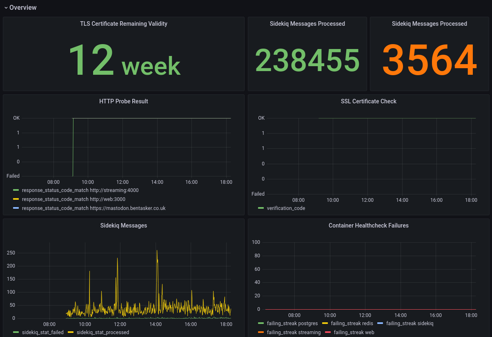

# Mastodon Monitoring Dashboard

This dashboard presents metrics collected from a [Mastodon](https://joinmastodon.org/) server and written into an InfluxDB instance.

An example `telegraf.conf` is provided for collecting the relevant metrics and more information is given in [Monitoring a Mastodon Instance with Telegraf](https://www.bentasker.co.uk/posts/documentation/general/monitoring-a-mastodon-instance-with-telegraf.html).

As well as a system overview, the dashboard has panes presenting relevant information for

* PostgreSQL
* Redis
* Sidekiq
* SSL
* Mastodon Usage Stats

